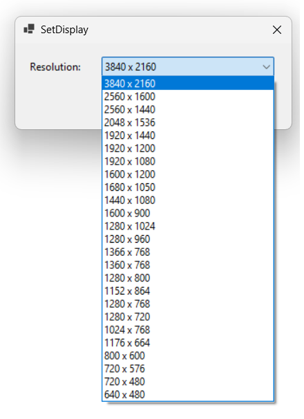

# SetDisplayZoom

SetDisplayZoom is a small Windows tray utility for quickly changing your display mode during calls and presentations.

## Screenshots



## What This Project Does

This app lets you switch to a lower display resolution on the fly (for example, from 3840 x 2160 to 1920 x 1080) and switch back later.

It is designed for scenarios like:

- presenting in Microsoft Teams
- sharing on mixed screen sizes
- making UI/text easier to read for viewers on smaller displays

The change is applied immediately by Windows, without requiring sign-out or reboot.

## Why Resolution Instead of DPI Scaling?

Windows DPI scaling changes can require sign-out/sign-in for full effect in many apps.

For presentation workflows, immediate resolution switching is more reliable and gives a live result right away.

## Features

- tray icon app (minimize to tray)
- lists supported display resolutions
- one-click apply of selected resolution
- lightweight WinForms UI

## Requirements

- Windows 10 or Windows 11
- .NET 8 SDK (for building from source)

## Build and Run

```powershell
dotnet build
dotnet run
```

## Typical Workflow

1. Open SetDisplayZoom from the tray.
2. Select a presentation-friendly resolution (for example, 1920 x 1080).
3. Click Apply.
4. After the presentation, switch back to your native resolution.

## Notes

- Only display modes supported by your monitor/GPU/driver are shown.
- If a mode is rejected by Windows, the app shows the error code.

## Project Structure

- `MainForm.cs`: main UI, display mode enumeration, and apply logic
- `Program.cs`: WinForms entry point
- `SetDisplayZoom.csproj`: project configuration

